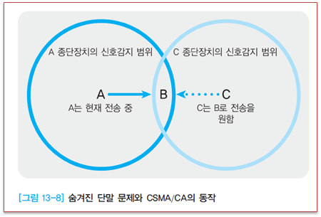

# 무선
## 기본
```
AP(Access Point): 유선과 무선을 연결해주는 역할
유선통신: IEEE802.3
무선통신: IEEE802.11

IEEE802.11 통신에서 데이터를 보내는 방식(CSMA/CA: Carrier Sense Multiple Access / Collision Avoidence)
1. Listen Air Space(radio wave): 즉 현재 통신이 일어나고 있는지 확인
2. Set Random wait timer before sending frame: 랜덤한 시간동안 기다림
3. After timer has passed, listen again and send: 랜덤한 시간이 흐르고 난 후 다시 확인하고 frame 전송
4. Wait for an ACK: ACK신호 기다림
5. If no ACK, resend the frame: ACK를 받지못하면 전송실패라 가정하고 1번부터 다시 시도
```
   
```
A, C는 기지국B의 신호감지 영역내에 있으며, A는 C의 신호감지 영역 밖에있고 반대도 마찬가지이다
A와 B가 데이터를 교환하는 중에 C가 B로 데이터를 보내고자 한다면?
먼저 B가 A로 데이터를 전송하는경우 C는 무선미디어 사용이 가능해질 때까지 대기함
하지만 A가 B로 데이터를 전송하는경우, C는 A의 신호를 감지할 수 없음
그래서 C는 B로 전송함 -> 충돌이 발생해 C입장에서는 A가 숨겨진상태(모르는상태)라 "숨겨진 단말문제"라고 함
-> 이 문제 극복을 위해 CTS(Clear To Send)/(Request To Send)라는 신호를 사요앟ㅁ
A가 B로 데이터를 전송하는 경우
A가 무선미디어를 확인한 후 Clear상태라면 A는 B로 RTS를 보냄(송/수신지, 데이터 크기 정보 등)
B가 A와 주고받을 준비가 되면 CTS 신호를 A로 전송 C는 이 CTS 신호를 감지할 수 있어 데이터를 보내지않음
```


## 모드
```
Ad Hoc 모드:
    AP를 사용하지 않고 PC에 무선 랜 카드만 곶아서 통신하는 방식
    무선 랜 카드의 모드를 Ad Hoc모드로 맞춰서 통신할 수 있음
Infrastructure 모드: 
    일반적으로 사용하는 무선 네트워킹 모드
    Basic Service Set: AP 1대
    Extended Service Set: AP 여러대, 여러 개의 AP를 하나의 무선 랜에서 사용해야하기 때문에 서로 다른 주파수로 구성해야함
                          IEEE802.11b의 경우 비중첩 채널은 3개까지 가능
                          IEEE802.11a의 경우 19개까지 가능(CISCO)

※ 주파수
무선을 통해 데이터를 이곳 저곳 전달하는데 서로 충돌이 없게 전송하기 위해선 주파수가 서로 달라야함
보통 2.4GHz, 5GHz 대역을 사용함
```

## 표준
[IEEE801.11 표준](https://ko.wikipedia.org/wiki/IEEE_802.11)   
[IEEE801.11p](https://ko.wikipedia.org/wiki/IEEE_802.11p)   
[IEEE801.11 Basic](https://www.google.com/url?sa=t&rct=j&q=&esrc=s&source=web&cd=&cad=rja&uact=8&ved=2ahUKEwiSjrKXvLD8AhWIplYBHXWaBOwQFnoECCMQAQ&url=https%3A%2F%2Fwww.cse.wustl.edu%2F~jain%2Fcse574-16%2Fftp%2Fj_05lan.pdf&usg=AOvVaw2KsqujYRH34Lkq1JQXmgpG)   

## 인코딩
```
무선통신을 한다는건 어떤 식으로든 데이터를 무선신호(radio signal)로 바꾸는 과정을 거침 -> 인코딩
FHSS(Frequence Hopping Spread Spectrum)
    무선신호를 많은 주파수 채널로 빠르게 바꿔가면서 전송(Hopping)
    잡음,간섭같은 고질적 통신 문제에 강점이 있는 방식
DSSS(Direct Sequence Spread Spectrum)
    여러 개의 채널 중에서 하나를 잡고 계속 그 채널로만 전송하는 방식 
    신호를 매우 작은 전력으로 넓은 대역으로 전송하기 때문에 잡음에 영향을 적게받고
    낮은 전력 사용으로 다른 통신에 영향을 덜 주며 보안에 우수
OFDM(Orthogonal Frequence Division Multiplexing)
    하나의 시그널을 여러 개의 다중 주파수를 이용해 전달하는 방식 
```

## SSID
```
무선 네트워크 이름, 32bit
같은 무선 네트워크 안에 있는 무선 장비들은 동일한 SSID를 가져야함
```