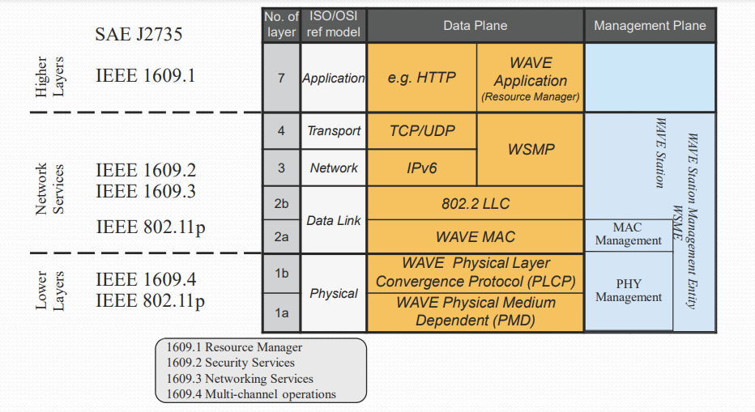

# WAVE
## WAVE
``` 
Wireless Access Vehicular Environments
```

## IEEE802.11p

```
Overview
IEEE 802.11p is based on:
    IEEE 802.11a PHY: OFDM moduation
    IEEE 802.11  MAC: CSMA/CA
    IEEE 802.11e MAC: enhancement: message prioritization

Multi-channel
1. Control-channel(CCH) without WBSS
    Broadcast communication
    Dedicated to short, high-priority, data and management frames:
        Safety-critical communication with low latencies
        Initialization of two-way communication on SCH
2. Service-channel(SCH) with WBSS
    Two-way communication between RSU and OBU or between OBUs
    For specific applications, e.g. tolling, internet access
    Different kinds of applications can be executed in parallel on different service channels
    Requires the setup of WAVE Bassic Service Set(WBSS prior to usage of the SCH

PHY
OFDM-based modulation similar to IEEE 802.11a
Halved channel bandwidth of IEEE 802.11a
    - 10 MHz channels
    - half data rate: 3-27 Mbps
    - doubled symbol duration: 8.0 us

MAC
멀티채널로 동작(1개의 제어채널, 6개의 서비스채널)
Based on Distributed Control Function(DCF) with CSMA/CA
    MAC-level acknowledgements for unicast communication,
    but no acknowledgements for broadcast communication
    unreliable broadcast communication
    RTS/CTS is only used on SCH -> because of higher range, slot time and SIFS should be longer
Addressing
    RSUs have a fixed 48-bit MAC address
    OBUs generate a random MAC address upon start-up of the device
    If a MAC address collision occurs the OBU automatically changes its MAC address

IEEE 1609.4
is a functional extension to IEEE 802.11e MAC to enable multi-channel coordination
functions
    - Channel routing
    - Data buffers(queues)
    - Prioritization
    - Channel coordination

IEEE 1609.3
Networking service
IP-based communication:
    IPv6-based with optional:
        mobile IPv6 and network mobility enhancements
    UDP and TCP on transport layer Transmission on SCH only
Non IP-based communication:
    Based on WAVE Short Message Protocol(WSMP) transmission on CCH or SCH
WSMP
    Networking protocol specifically designed for V2X communications
    WSMP can use CCH and SCH
    During the SCH Interval low priority messages can be transmitted on CCH for stations that do not switch to a SCH, 
    high priority frames and WAVE Announcement frames shall be transmitted during the CCH Interval

IEEE 1609.2
Security service

SAE J2735
Dedicated Short Range Communication (DSRC) Message Set Dictionary

정리
1 - PHY Layer
    OFDM 기반 모듈(10Mhz, 데이터전송속더 1/2배, 심볼길이 2배)
2 - MAC Layer(IEEE 1609.4)
    CSMA/CA 기반, 멀티채널로 동작
    짧고 높은 우선순위를 가진 데이터(중요한 데이터)를 위한 Control-channel(CCH)
    OBU, RSU를 위한 Service-channel(SCH)
3 - NETWORK Layer(IEEE 1609.3)
    IP기반 통신을 위한 TCP/IP 통신 - SCH만 이용가능
    Non IP기반 통신을 위한 WSMP(WAVE Short Message Protocol) - SCH, CCH 모두 이용가능
4 - Application Layer
    BSM을 생성하고 처리하는 기능, 보안계층(IEEE 1609.2)과 연동해 서명과 검증, 암호기능 제공
```